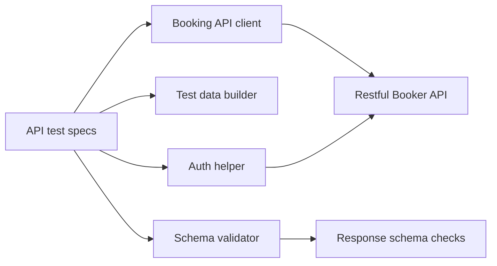

# api-automation-playwright-restful-booker

[](https://github.com/intiser321/api-automation-playwright-restful-booker/actions/workflows/api-tests.yml)

API automation framework using Playwright, TypeScript, JSON schema validation, and GitHub Actions to test Restful Booker booking APIs.

## Business value

This project demonstrates how API automation can protect core service behavior and reduce regression risk.

The framework validates important booking API workflows such as authentication, booking creation, retrieval, updates, deletion, negative cases, and schema validation. These checks help detect broken API behavior earlier and give teams more confidence before release.

Schema validation is especially useful because it can catch contract changes even when a response still returns a successful status code.

## Tech Stack

- Playwright Test
- TypeScript
- AJV for JSON schema validation
- Prettier for formatting
- GitHub Actions for CI

## API Under Test

Base URL:

```text
https://restful-booker.herokuapp.com
```

Main endpoints covered:

- `GET /ping`
- `POST /auth`
- `GET /booking`
- `GET /booking/{id}`
- `POST /booking`
- `PUT /booking/{id}`
- `PATCH /booking/{id}`
- `DELETE /booking/{id}`

## Test Coverage

- Health check API
- Auth token creation
- Get all booking IDs
- Get booking by valid ID
- Get booking by invalid ID
- Create booking
- Filter booking by firstname and lastname
- Delete booking with valid token
- Delete booking without token
- Create booking with missing required field
- Create duplicate booking payloads
- Full update with `PUT`
- Unauthorized `PUT`
- Partial update with `PATCH`
- Unauthorized `PATCH`

## Test Strategy

The test suite is organized around API risk areas:

- Health check to confirm service availability
- Authentication to validate token generation
- Booking lifecycle checks for create, read, update, partial update, and delete
- Negative scenarios for invalid IDs, missing required data, and unauthorized requests
- JSON schema validation to detect response contract issues

The goal is not only to check status codes. The suite also validates response structure and important business fields.

## Folder Structure

```text
src/
  api/
    bookingClient.ts        Booking API client methods
  data/
    bookingData.ts          Booking payload type and test data builder
  helpers/
    authHelper.ts           Reusable auth token helper
    schemaValidator.ts      AJV schema validation helper
  schemas/
    authSchemas.ts          Auth response schema
    bookingSchemas.ts       Booking response schemas

tests/
  api/
    auth.spec.ts
    booking.spec.ts
    ping.spec.ts

.github/
  workflows/
    api-tests.yml           GitHub Actions workflow
```

## Framework Architecture



## What this demonstrates for clients

- Playwright API testing with TypeScript
- Reusable API client methods
- Auth helper for token-based flows
- Test data builder for cleaner payloads
- JSON schema validation with AJV
- Positive and negative API coverage
- Smoke and regression command separation
- GitHub Actions CI workflow
- README documentation for setup and handover

## Setup

Install dependencies:

```bash
npm install
```

On Windows PowerShell, if `npm` is blocked by execution policy, use:

```bash
npm.cmd install
```

## Run Tests

Run all tests:

```bash
npm test
```

Windows PowerShell:

```bash
npm.cmd test
```

Run smoke tests:

```bash
npm run test:smoke
```

Run regression tests:

```bash
npm run test:regression
```

Run only auth tests:

```bash
npm run test:auth
```

Run only booking tests:

```bash
npm run test:booking
```

## Run by Double-Click

Windows users can double-click:

```text
run-tests.bat
```

The batch file will:

1. Open from the project root
2. Install dependencies with `npm.cmd ci` if `node_modules/` is missing
3. Run `npm.cmd test`
4. Keep the window open so the result is visible

## Reports

The project uses Playwright HTML reports.

Run tests first:

```bash
npm test
```

Open the latest report:

```bash
npm run report
```

Generated report files are saved in:

```text
playwright-report/
```

This folder is ignored by Git.

## Formatting

Format files:

```bash
npm run format
```

Check formatting:

```bash
npm run format:check
```

## Framework Design

### API Client Pattern

Booking API calls are centralized in:

```text
src/api/bookingClient.ts
```

Tests call methods like:

```ts
bookingClient.createBooking(bookingPayload);
bookingClient.getBookingById(bookingId);
bookingClient.deleteBooking(bookingId, token);
```

This keeps endpoint details out of the tests.

### Test Data Builder

Booking test data is created with:

```text
src/data/bookingData.ts
```

Example:

```ts
const bookingPayload = buildBookingPayload({
  firstname: 'Patch',
  lastname: 'Test'
});
```

This avoids repeating full payload objects in every test.

### Auth Helper

Auth token creation is reusable:

```text
src/helpers/authHelper.ts
```

Example:

```ts
const token = await createAuthToken(request);
```

### JSON Schema Validation

Response shape validation uses AJV.

Schemas are stored in:

```text
src/schemas/
```

Validation helper:

```text
src/helpers/schemaValidator.ts
```

Pattern used in tests:

```ts
const createdBooking = validateSchema(createBookingResponseSchema, await response.json());
expect(createdBooking.booking).toMatchObject(bookingPayload);
```

This checks response structure first, then checks expected values.

## GitHub Actions

Workflow:

```text
.github/workflows/api-tests.yml
```

It runs on:

- push
- pull request

The workflow:

1. Checks out the repository
2. Sets up Node.js
3. Installs dependencies with `npm ci`
4. Runs API tests
5. Uploads the Playwright HTML report as an artifact

## Learning Notes

- `GET` retrieves data
- `POST` creates data
- `PUT` performs full update
- `PATCH` performs partial update
- `DELETE` removes data
- Authenticated endpoints use a token cookie
- Schema validation checks response shape and data types
- Value assertions check actual business expectations
